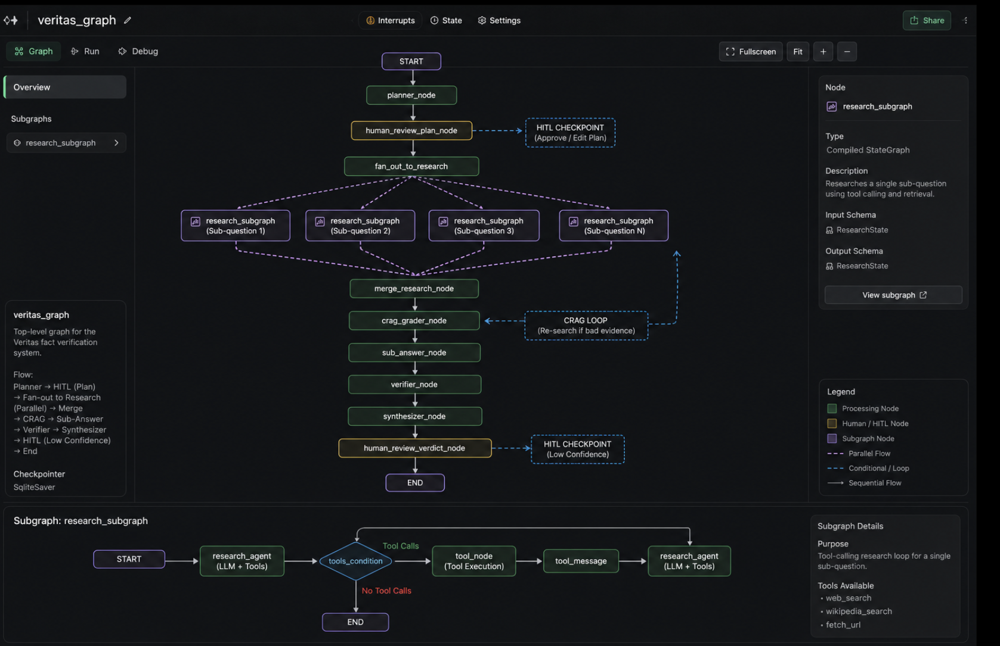
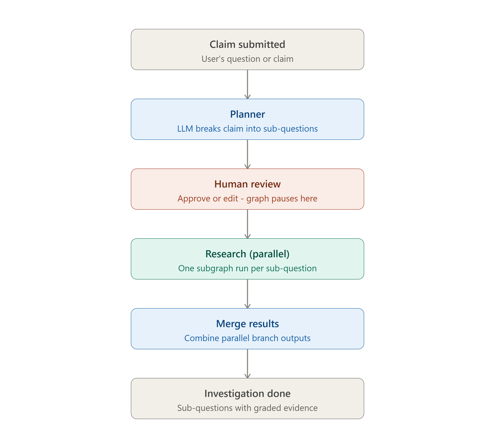
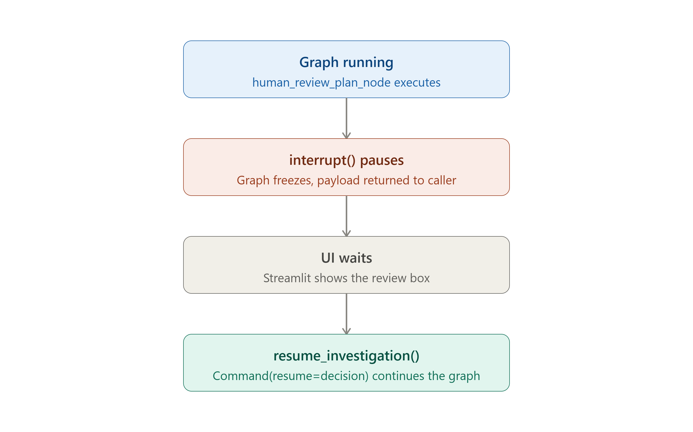
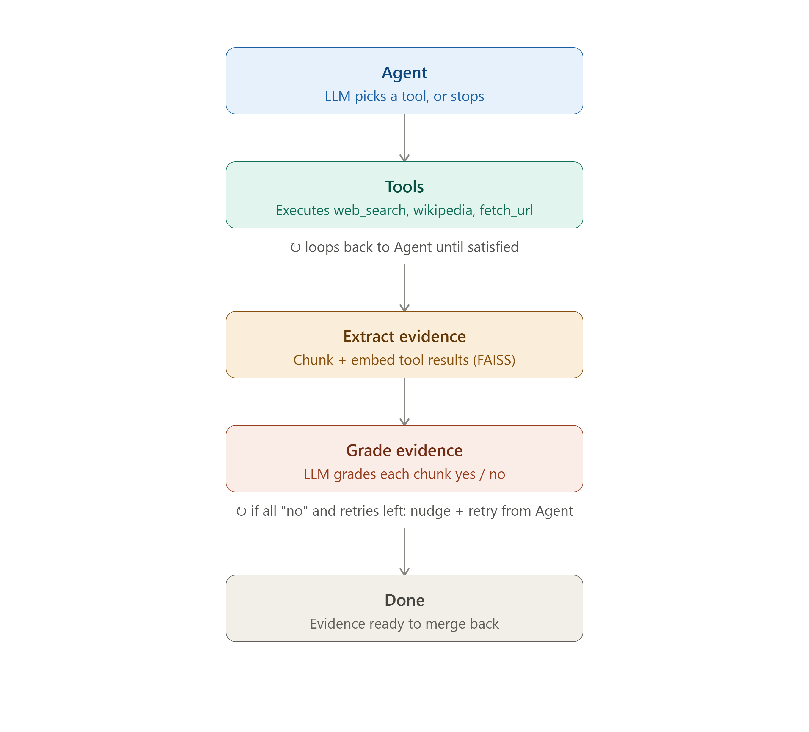
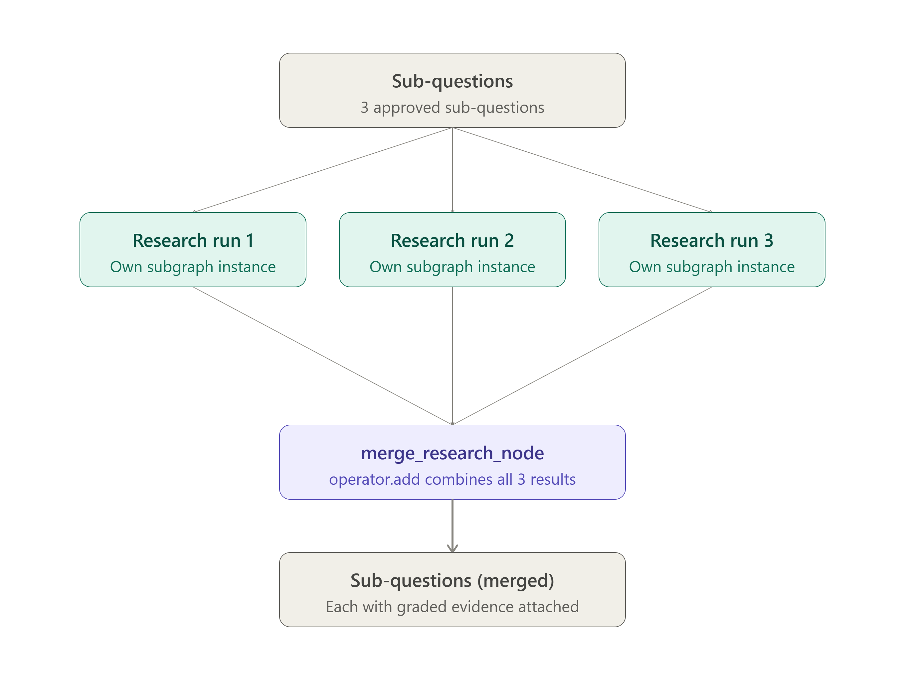
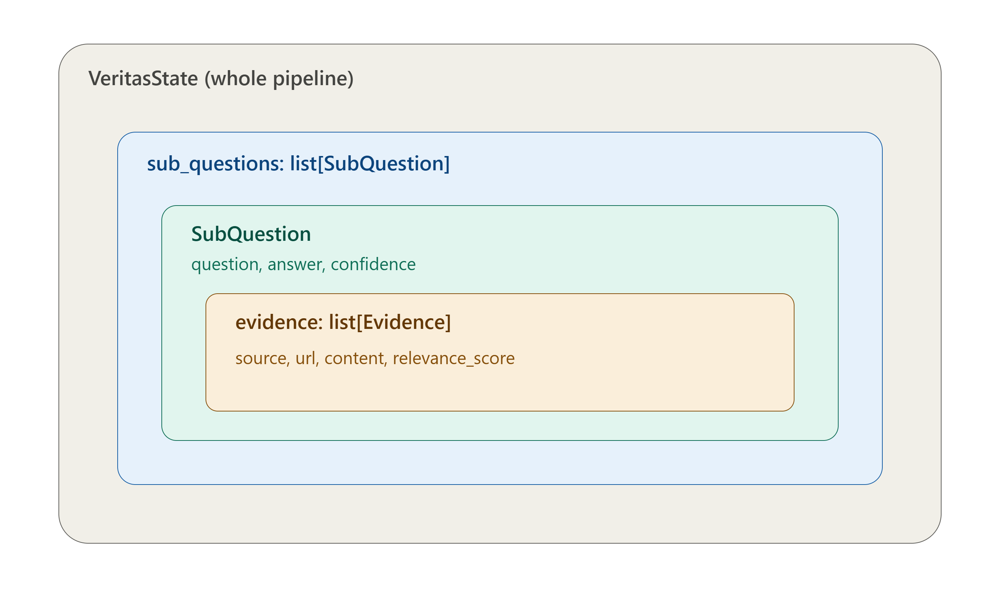
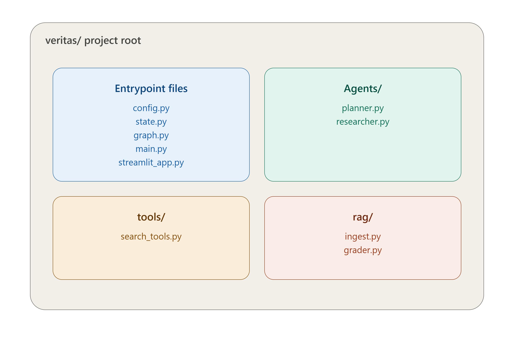

# Veritas — Autonomous Research & Fact-Verification Agent

Veritas is a multi-agent [LangGraph](https://www.langchain.com/langgraph) system that takes a claim or research question, breaks it into sub-questions, researches each one using tool-calling agents (web search, Wikipedia), grades its own retrieved evidence and re-searches when it's weak (Corrective RAG), and — once complete — will cross-verify findings and produce a final verdict with citations and a confidence score.

Every plan change goes through a human-in-the-loop checkpoint before any research spend, and every investigation is resumable via SQLite-backed checkpointing.

## Target architecture



## Current build status

Steps 1–6 of the roadmap are complete:

| Step | What it adds |
|---|---|
| 1 | Project setup — shared LLM/embeddings config |
| 2 | State design — `VeritasState`, `SubQuestion`, `Evidence` |
| 3 | Planner agent — claim → sub-questions, with human-in-the-loop review |
| 4 | Research subgraph — parallel fan-out, chunking + FAISS retrieval |
| 5 | Tool calling — LLM-driven `web_search` / `wikipedia_search` / `fetch_url` |
| 6 | Corrective RAG — relevance grading + retry loop on weak evidence |

Not yet built: sub-answer generation, cross-verification, final synthesis, long-term memory, tracing, MCP server, and the eval harness.

## Pipeline overview

The graph runs through six stages per investigation: claim submitted, planner, human review (pause), parallel research, merge, done.



### Human-in-the-loop review

Before any research begins, the graph pauses via `interrupt()` so the proposed sub-questions can be approved or edited.



### Research subgraph — tool calling + Corrective RAG

Each sub-question runs through its own subgraph: an LLM-driven tool-calling loop, followed by relevance grading. If everything graded irrelevant, it retries with a broadened search (up to a retry cap).



### Parallel fan-out and merge

Sub-questions are researched in parallel using `Send`, then merged back together via an `operator.add` reducer.



### State shape

`VeritasState` nests `SubQuestion`, which nests `Evidence` — this is what lets each sub-question be researched and graded independently.



## Project structure



```
veritas/
├── config.py              # shared LLM + embeddings client
├── state.py                # VeritasState, SubQuestion, Evidence
├── graph.py                 # compiled graph, checkpointer, HITL node
├── main.py                   # CLI entrypoint
├── streamlit_app.py           # Streamlit UI
├── requirements.txt
├── Agents/
│   ├── planner.py              # claim -> sub-questions
│   └── researcher.py            # tool-calling + CRAG subgraph
├── tools/
│   └── search_tools.py           # web_search, wikipedia_search, fetch_url
├── rag/
│   ├── ingest.py                  # chunk + embed + similarity filter
│   └── grader.py                   # CRAG relevance grading
└── data/                            # SQLite checkpoints (generated at runtime)
```

## Setup

```bash
python -m venv .venv
source .venv/bin/activate   # Windows: .venv\Scripts\activate
pip install -r requirements.txt
```

Create a `.env` file in the project root:

```
GEMINI_API_KEY=your_gemini_api_key_here
```

## Running it

**Streamlit UI:**
```bash
streamlit run streamlit_app.py
```

**CLI:**
```bash
python main.py
```

Either way: enter a claim, review and approve (or edit) the proposed sub-questions, and Veritas researches each one in parallel — searching, grading its own evidence, and retrying automatically when the first pass comes back weak.

## Tech stack

- **LangGraph** — state machine, subgraphs, parallel fan-out (`Send`), human-in-the-loop (`interrupt`/`Command`), SQLite checkpointing
- **Gemini 2.5 Flash** (`langchain-google-genai`) — planning, tool-calling agent, relevance grading
- **FAISS** — in-memory similarity search over retrieved evidence chunks
- **DuckDuckGo / Wikipedia** — search tools
- **Streamlit** — UI

## Documentation

- `EXPLANATION.md` — every file, class, and function explained in detail, plus the LangGraph fundamentals needed to read the code
- `FLOW.md` — a full trace of what runs, in order, for one investigation
